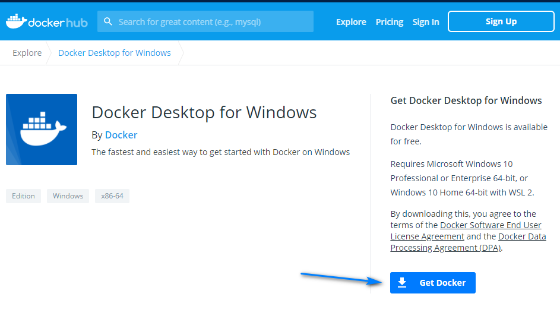
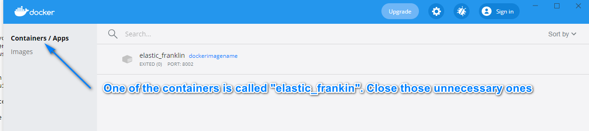
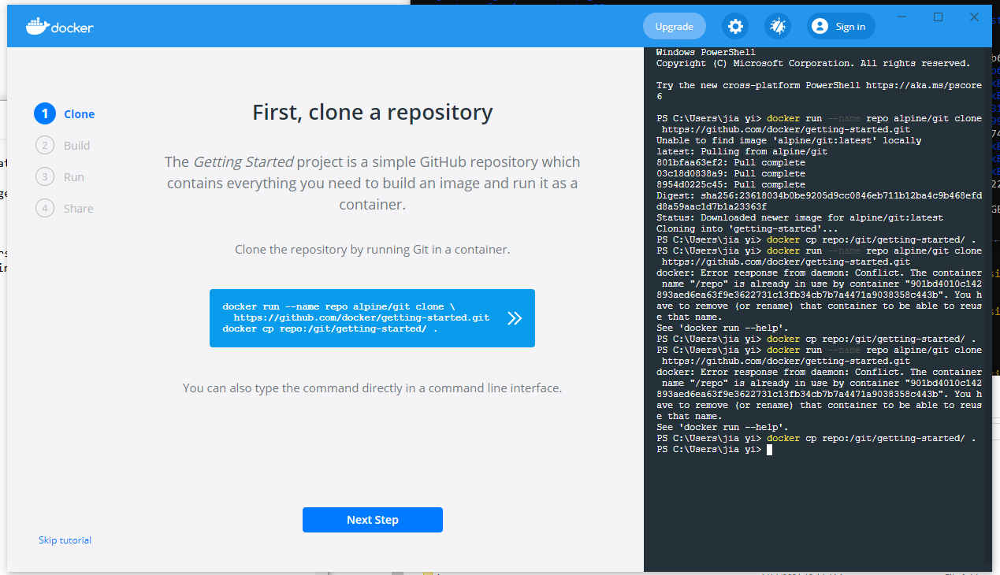

# Image Classification Application deployed with Flask on Heroku
The link to the app is : https://image-classification-jy2.herokuapp.com/  

This project is done as part of AIAP assignment 7. This is a front-to-end project, where the end goal is to serve a deep learning model on the web. In this web app, a trained model is used to predict 12 different food classes, namely chilli crab, curry_puff, dim sum, ice kacang, kaya toast, nasi ayam, popiah, roti prata, sambal stingray, satay, tau huay and wanton noodle.

## Architecture of Model
The base architecture is a MobileNetV2 model, followed by a Dense layer of 512 neurons and a Dropout layer of 0.2. It is fine-tuned on the last 3 layers on a training set of about 800 images. Optimizer used was Adam with a learning rate of 0.001 and decay of 0.000001. The validation accuracy achieved was 70%.

Below table provides a summary of other specifications:

|Specification|Description |---|--- |Framework|Tensorflow with Keras |Base Model|ResNet50 |Weights|ImageNet |Loss |Cateogorical Cross Entropy |Activation Function |Softmax |Optimizer|Adam |Learning Rate (Decay)|1e-3 (1e-6) |Batch Size|32 |Train-Test-Split %|80-10-10 |Image Dimensions|224 x 224 x

## Preprocessing and Training
### Dealing with images
Images have to be resized because of our base architecture that we use which is ResNet50. It is pre-trained on ImageNet on (160 x 160 x 3) images, hence it would be advisable to use images of those sizes. Therefore, we used the ImageDataGenerator object together with the flow_from_directory object from Keras to augment and resize our image. Namely, these are the augmentations that were performed:

``` 
self.HEIGHT = 160
self.WIDTH = 160
self.batchsize = 32 
self.train_datagen = ImageDataGenerator(
            shear_range=50,
            rotation_range=45,
            #width_shift_range=0.5,
            #height_shift_range=0.5,
            brightness_range=(1,1.2),
            zoom_range=[1,1.5],
            horizontal_flip=True,
            #fill_mode='reflect',
            rescale=1./255)

self.train_gen = self.train_datagen.flow_from_directory(
            directory=self.train_dir,
            target_size=(HEIGHT, WIDTH),
            color_mode="rgb",
            batch_size=batch_size,
            class_mode="categorical",
            shuffle=True,
            seed=42)
```

Note: Augmentation is only done on the train set

## Building the model
The model is built on top of MobileNetV2 and fine-tuned on the last 100 layers, with an additional Dense layer at the end together with a Dropout layer.


``` 
model = MobileNetV2(input_shape=(self.shape, self.shape, 3), include_top=False, weights='imagenet')

self.model = tf.keras.Sequential(name='food_model')
        self.model.add(base_model)
        self.model.add(tf.keras.layers.Dense(256, activation='relu', name='fc_2'))
        self.model.add(tf.keras.layers.Dropout(0.1))
        self.model.add(tf.keras.layers.Dense(12, activation='softmax', name='output'))  
        
```

## Training the model
We use the Adam optimizer together with a categorical cross-entropy loss function when we compile our model. We then fit the model on our images on less than 10 epochs with an EarlyStopping callback on validation loss with patience of 5.
```
def train_model(self,base_learning_rate = 0.001, filename = 'checkpoint.h5', EPOCH = 10):
        ''' training the model'''
        self.model_path = filename
        self.model.compile(optimizer=tf.keras.optimizers.Adam(lr=base_learning_rate,beta_1=0.9,beta_2=0.999),
                      loss='categorical_crossentropy',
                      metrics=['accuracy'])
        early_stop = tf.keras.callbacks.EarlyStopping(
            monitor='val_loss',
            verbose=1,
            patience=5)

        model_checkpoint_callback = tf.keras.callbacks.ModelCheckpoint(
            filepath= filename,
            save_weights_only=False,
            monitor='val_loss',
            mode='min',
            save_best_only=True)
            
        history = self.model.fit(self.train_gen,
                steps_per_epoch=self.STEP_TRAIN,
                validation_data= self.val_gen,
                validation_steps=self.STEP_VAL,
                callbacks=[early_stop, model_checkpoint_callback],
                epochs= EPOCH) 
        return history
```

## Dataset used for Training
The images used for training consists of 12 different classes, including:

Food|No. of Images ---|--- Tau Huay|52 Curry Puff|85 Chilli Crab|82 Dim Sum|137 Ice Kacang|73 Kaya Toast|81 Nasi Ayam|69 Popiah|81 Satay|82 Wanton Noodle|81 Sambal Stingray|83 Roti Prata|81

## Performance of Model
Our model had a validation accuracy of 21%. May need to revisit week 5 model and tweak the model to train again.

## Getting Started
### Prerequisites
We will be using Flask as our web application framework because it is lightweight and designed to make getting started quick and easy. It wraps around Werkzeug and Jinja2. We will also require Tensorflow and sci-kit learn for our machine learning frameworks. Finally, we will require Pillow to deal with images.

To install TensorFlow 2.4, please refer to [TensorFlow installation page](https://www.tensorflow.org/install/pip#tensorflow-2.0-rc-is-available) regarding the specific install command for your platform.

To install [Flask ==1.1.2](https://pypi.org/project/Flask/), please follow their installation documentation.

To install Pillow, please follow their installation documentation.

## Usage
These instructions will get you a copy of the project up and running on your local machine for development and testing purposes. See deployment for notes on how to deploy the project on a live system.

## To get inference on an image from Terminal:
git clone python -m src.inference your_image.jpg

To get inference on Web App:
Run app.py locally by typing the commands in the Terminal:
```
python -m src.app
```
This will run the app on your local machine's port 8000. Copy the link into the browser or type localhost:8000 in the url. 

Simply upload an image and select the Classify button to get a prediction!

## Running unit tests
We will be using pytest to run unit tests for our project. To install, please follow this [link](https://docs.pytest.org/en/latest/getting-started.html) to their installation documentation.

Unit tests are used to test the validity of our code. From the main project directory, run:

pytest

to execute the unit tests. Pytest will automatically scan the tests folder and execute the functions in test_inference.py.

## Breaking down each unit test
Testing image shape: Our model runs on 160x160x3 images and by default, we have functions to handle images that are not in these format. The following tests whether or not the images have been successfully handled to fit that format.

SHAPE = 160 assert inf._resize_image(Image.open(TEST_IMG)).shape == (SHAPE, SHAPE, 3)

## Deployment
Our model is deployed on a Docker container and hosted on AISG's cluster.

The web application is created using Flask, together with Pure-CSS as the CSS template and Vue.js as the Javascript framework.

The folder structure is as such:
```
src                                 # Main project folder
+-- app.py                          # Main file containing Flask
+-- inference.py                    # Python file containing our Model
|   +-- static                      # Folder to contain static assets
|   |   +-- css
|   |   |   +-- main.css            # Main css file
|   +-- templates                   # HTML templates folder
|   |   +-- index.html              # Contains bulk of our HTML body
|   |   +-- base.html               # Contains base HTML structure with links/scripts
```

Before using this code for deployment, please ensure that this runs on your local machine first. You should attempt to build a Docker Image and run that image locally before deploying it.

## How to deploy a local Docker
First we need to write a Dockerfile in our main assignment7 path
```
# Dockerfile
# Add a line here to specify the docker image to inherit from.
FROM registry.aisingapore.net/aiap/polyaxon/pytorch-tf2-cpu:latest

ARG WORK_DIR="/home/polyaxon"
ARG USER="polyaxon"

WORKDIR $WORK_DIR

# Add lines here to copy over your src folder and 
# any other files you need in the image (like the saved model).
# COPY file
COPY src src/
COPY conda.yml README.md tensorfood.h5 ./

# Add a line here to update the base conda environment using the conda.yml. 
RUN conda env update -f conda.yml -n base && \
    rm conda.yml

# DO NOT remove the following line - it is required for deployment on Tekong
RUN chown -R 1000450000:0 $WORK_DIR

USER $USER

EXPOSE 8000
# behind 8000

# Add a line here to run your app
CMD [ "python" , "-m", "src.app"]
```

If you are using Windows machine, you may install the docker [here](https://hub.docker.com/editions/community/docker-ce-desktop-windows)


We can run this command to build an image, it will take a lot of time for the first build
```
docker build -t dockerimagename:latest .
```
where "dockerimagename" is the name of my image, "." means build the docker locally.

After build, we should run it by:
```
docker run -p 8000:8000 dockerimagename
```

The first 8000 is the tunnel to the outside of the docker, in this case, is the port to the localhost.

The second 8000 is the tunnel to inside the docker, which is shown by "expose 8000" in the Dockerfile.

After it starts running it will prompt you to open localhost:8000

When you are done with your docker, remember to stop your container or it will take up a lot of ram
To do so, follow:
```
# list all the images and containers
docker ps -a

# remove the containers according to names
docker rm <container_name1> <container_name2>
```

Other than this you can also close them from the GUI of DockerHub



## What is CI/CD 
CI/CD stands for continuous integration and continuous development. In short, it allows DevOps teams to increase the speed of software development in a quicker and more consistent manner.

TLDR: Continuous integration comes about when we integrate code in a shared repository, which will be validated when developers perform a Merge request

Validation is done through a pipeline trigger, which will build, test and validate the quality of the developer's code. Upon validation, changes will then be made to the repository.

Continuous delivery is a result of having continuous integration

Note that continuous delivery does not equate to automatic deployment. It simply means having the ability or option to deploy as a result of CI-validated code.

## CICD Workflow 
mermaid graph LR A((Developer)) -- Push code changes --> B[Build/Test] B -- Failed tests --> A B -- Push code fixes --> C[Build/Test] C --> D(Review and Approve) D --> E{Merge} A --> E E --> F(Automated Build Test Deploy)

mermaid sequenceDiagram Developer ->> Build/Test: Continuous Integration Build/Test--x Developer: Failed Tests Note left of Review and Approve: CI is the process of <br>continually pushing <br> and reviewing <br>code Note right of Merge: CD is the ability to <br> push out code as a<br> result of CI Merge -->> Deploy: Continous Delivery


### Authored by : Jia Yi
Referencing David Chong's Readme